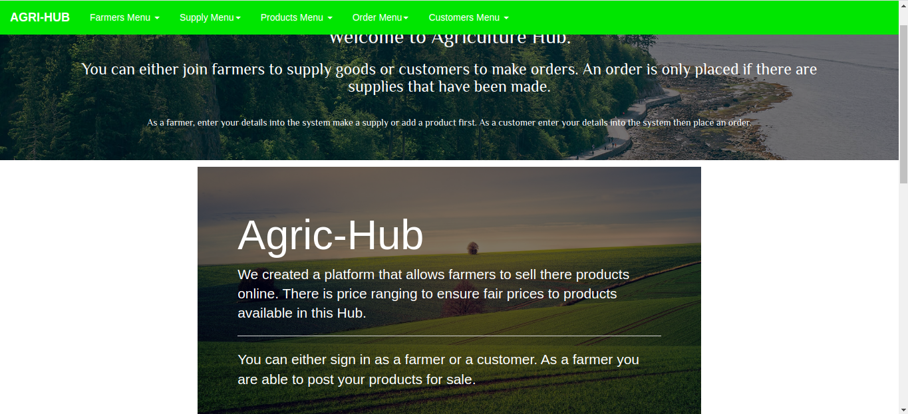

# Agric-Hub
##### By Vincent Kipngeno, Abubakar Ramadhan, Maureen Chepkirui, Brian Muthaka

## Description
This App was created to fill in the gap of retailers by connecting farmers products to customers.

## Screenshot

## Built With
1. Java & Gradle
2. Spark
3. Junit for testing
4. PostgreSQL database

## Setup/Installation Requirements
* To use this project, clone it.
* Make sure java, gradle, heroku,postman extension and postgresql is installed
* Navigate to src/main/java/resources/db and run in terminal psql < create.sql(creates required database with required tables)
* Test links in App in postman.
* Clone Github link https://github.com/Vincent-kipngeno/agric-hub-java

## Live Site

## Support and contact details
For any questions concerning the app contact our SCRUM master through the email vincentkipngeno@gmail.com. 
Feel free to give your feedback too.

### License

Copyright (c) 2020 **Vincent Kipngeno**,
**Abubakar Ramadhan**, **Maureen Chepkirui**, **Brian Muthaka**